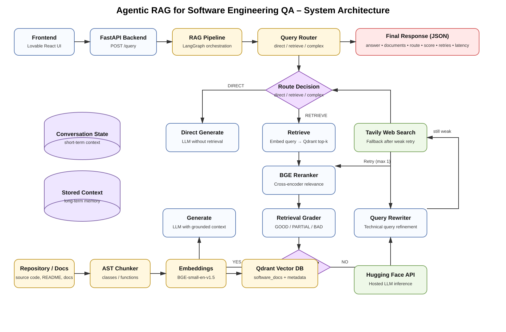

# 🤖 Agentic RAG for Software Engineering QA — Hugging Face Deployment

An **Agentic Retrieval-Augmented Generation (RAG)** system for answering software-engineering questions over source code and technical documentation.

This deployment version keeps the working RAG architecture intact while replacing the locally hosted Ollama/Mistral generation layer with the **Hugging Face Inference API**.

## 🏗️ System Architecture



The system follows this flow:

```text
User
  ↓
Lovable Frontend
  ↓
FastAPI /query
  ↓
LangGraph Workflow
  ↓
Query Router
  ├── DIRECT ───────────────→ LLM
  └── RETRIEVE / COMPLEX
             ↓
        Query Embedding
             ↓
           Qdrant
             ↓
        BGE Reranker
             ↓
      Retrieval Grader
        ├── GOOD ───────────→ Generate
        └── PARTIAL / BAD
                  ↓
             Query Rewrite
                  ↓
             Re-retrieval
                  ↓
          Still insufficient?
                  ↓
             Tavily Search
                  ↓
               Generate
                  ↓
            JSON Response
```

## ✨ Features

- 🧭 **Agentic Query Routing** — direct, retrieve, and complex paths
- 🔎 **Semantic Repository Retrieval** using sentence-transformer embeddings and Qdrant
- 🎯 **BGE Cross-Encoder Reranking** for improved relevance
- 🧪 **Retrieval Grading** to detect weak context
- 🔄 **Corrective RAG** with query rewriting and retry
- 🌐 **Tavily Web Search Fallback** when repository evidence is insufficient
- 🤗 **Hugging Face Inference API** for hosted LLM generation
- ⚡ **FastAPI REST API** backend
- 🎨 **Lovable React/Vite Frontend** with execution trace and retrieval details
- 🐳 **Docker** support
- 📊 **RAGAS evaluation** for answer relevancy, faithfulness, and context precision

## 🧠 Agentic RAG Workflow

A traditional RAG system usually follows:

```text
Question → Retrieve → Generate
```

This project adds adaptive decisions and recovery:

```text
Question
   ↓
Query Router
   ↓
Retrieve
   ↓
Rerank
   ↓
Grade retrieval
   ↓
Good? ───────────────→ Generate
   │
   No
   ↓
Rewrite query
   ↓
Retry retrieval
   ↓
Still weak?
   │
   Yes
   ↓
Tavily Web Search
   ↓
Generate
```

That decision-making and retry behavior is what makes the pipeline **agentic** rather than a fixed retrieve-and-generate chain.

## 🔍 Retrieval Pipeline

### 1. Repository ingestion

Source code and documentation are collected from the target repository.

### 2. Code-aware chunking

Python files can be split around semantic units such as classes and functions rather than relying only on arbitrary text boundaries.

### 3. Embeddings

Chunks are converted into vector representations using the configured BGE embedding model.

### 4. Qdrant retrieval

Embeddings and metadata are stored in the existing `software_docs` collection. Query-time semantic search retrieves candidate chunks.

### 5. Reranking

A BGE cross-encoder reranks the retrieved candidates using query-document relevance.

### 6. Retrieval grading

The grader classifies context as `GOOD`, `PARTIAL`, or `BAD`.

### 7. Query rewriting

Weak retrieval triggers a technically focused query rewrite followed by another retrieval attempt.

### 8. Web fallback

If repository context remains insufficient, Tavily can provide external information before final generation.

## 🤗 Hugging Face LLM

The HF deployment replaces the local model server:

```text
Original:
LangGraph → Ollama → Mistral 7B

Deployment:
LangGraph → HuggingFaceClient → Hugging Face Inference API
```

The Hugging Face client uses the OpenAI-compatible inference endpoint:

```text
https://router.huggingface.co/v1
```

Configure the hosted model through environment variables instead of committing credentials.

## 🗄️ Existing Qdrant Collection

The deployment is designed to use the existing collection:

```text
software_docs
```

No new collection is required and the indexed vectors do not need to be re-created merely because the LLM provider changed.

For a cloud deployment, `QDRANT_URL` must point to a Qdrant instance reachable from the deployed backend; `localhost:6333` only works when Qdrant is running on the same machine.

## ⚙️ Environment Variables

Create a local `.env` file or configure these as deployment secrets:

```env
HF_TOKEN=your_huggingface_token
HF_MODEL=google/gemma-2-2b-it
HF_BASE_URL=https://router.huggingface.co/v1
HF_MAX_NEW_TOKENS=512

QDRANT_URL=your_qdrant_url
QDRANT_API_KEY=your_qdrant_api_key
QDRANT_COLLECTION=software_docs

TAVILY_API_KEY=your_tavily_api_key
```

**Never commit real API keys or tokens to GitHub.**

## 🚀 Run Locally

Clone the deployment repository:

```bash
git clone https://github.com/pavanbhatkar1/agentic-rag-se-qa-hf.git
cd agentic-rag-se-qa-hf
```

Create and activate the Python environment, then install dependencies:

```bash
python -m pip install -r requirements.txt
```

Run FastAPI:

```powershell
uvicorn main:app --reload --host 0.0.0.0 --port 10000
```

Run the frontend in another terminal:

```powershell
cd lovable-frontend
npm install
npm run dev
```

Open:

```text
http://localhost:5173
```

Backend API:

```text
http://localhost:10000
```

Swagger:

```text
http://localhost:10000/docs
```

## 🔌 API

### `POST /query`

Request:

```json
{
  "question": "How is the QueryRouter class implemented in this project?"
}
```

The response contains the generated answer plus execution metadata such as:

```json
{
  "answer": "...",
  "route": "retrieve",
  "documents": [],
  "retrieval_score": 1.0,
  "retry_count": 0,
  "web_search_used": false,
  "latency_ms": 1234.5
}
```

## 🧩 Tech Stack

| Layer | Technology |
|---|---|
| Frontend | React, Vite, TypeScript, Lovable UI |
| API | FastAPI, Uvicorn |
| Agent orchestration | LangGraph |
| Vector database | Qdrant |
| Embeddings | Sentence Transformers / BGE |
| Reranking | BGE Cross-Encoder |
| LLM | Hugging Face Inference API |
| Web fallback | Tavily |
| Evaluation | RAGAS |
| Containerization | Docker |

## 📁 Important Project Files

```text
app/
├── api/routes.py
├── core/config.py
├── embeddings/
├── graph/
│   ├── nodes.py
│   ├── query_rewriter.py
│   ├── retrieval_grader.py
│   ├── router.py
│   ├── state.py
│   └── workflow.py
├── llm/
│   └── huggingface_client.py
├── rag/
│   └── rag_pipeline.py
├── retrieval/
├── vectorstore/
└── websearch/

lovable-frontend/
├── src/
├── package.json
└── vite.config.ts

scripts/
└── index_repository.py

Dockerfile
requirements.txt
README.md
```

## 🧪 Example Questions

### Direct LLM

```text
What is the difference between REST API and GraphQL?
```

Expected: `DIRECT` path.

### Repository retrieval

```text
How is the QueryRouter class implemented in this project?
```

Expected: repository retrieval with sources such as `app/graph/router.py`.

### Multi-document retrieval

```text
Explain the architecture of this project and how the RAG workflow works.
```

Expected: multiple repository documents and a grounded answer.

### Corrective RAG

```text
How does the system handle irrelevant retrieved context?
```

Expected: retrieval grading → query rewrite → retry when necessary.

### Web fallback

```text
What are the latest changes introduced in Python 3.14?
```

This can exercise the external web-search fallback when repository context is insufficient.

## 📊 Evaluation

The project includes benchmark and RAGAS evaluation support for:

- Answer Relevancy
- Faithfulness
- Context Precision
- Latency

## 🎯 Interview Summary

The core design can be summarized as:

```text
FastAPI      = API boundary
LangGraph    = orchestration
GraphState   = shared workflow state
QueryRouter  = routing decision
Qdrant       = vector retrieval
BGE Embedder = semantic representation
BGE Reranker = relevance ranking
Grader       = retrieval validation
Rewriter     = corrective retrieval
Tavily       = external fallback
HF API       = hosted LLM generation
Frontend     = workflow visualization
RAGAS        = evaluation
Docker       = deployment packaging
```

## 📄 License

This project is intended for educational and research purposes.
